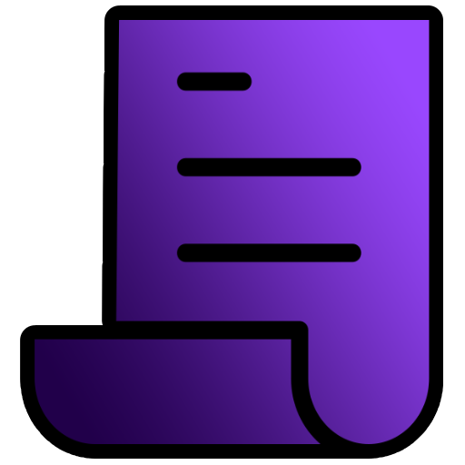

<div align="center">
  

  <h1>Manifest of Liberty</h1>

  <p>
    <strong>SteamPipe 内部原理与 Steam CDN 身份验证教育与技术指南</strong>
  </p>

  <p>
    
    
    
  </p>

  <p>
    <a href="README.md"></a>
    <a href="README_HU.md"></a>
    <a href="README_RU.md"></a>
    <a href="README_ZH.md"></a>
  </p>
</div>

<hr>

> **免责声明**: 本文档项目仅供教育、历史研究与技术交流使用。

## 核心内容

- **CM 与 CDN 架构**: 连接管理器（Connection Manager）与内容分发网络（Content Delivery Network）机制详解。
- **PICS 与元数据**: 应用产品信息格式、PICS 访问令牌（Access Token）及受限元数据读取。
- **Depot 与清单 (Manifest)**: Depot 结构、清单 GID、Protobuf 载荷及数据块（Chunk）映射。
- **密钥与验证**: 清单请求代码（MRC）、公共镜像回退机制及 32 字节 AES Depot 解密密钥。
- **下载流水线**: 内容服务器选择、数据块解压（LZMA/VZ）及 Steam 解锁器 Lua 配置文件生成。
- **OpenSteamTool 原理**: OpenSteamTool 内部架构、票据提取工具、Denuvo/SteamStub 凭据与 Lua 脚本。

## 本地运行

### 环境要求

- Node.js v18 或更高版本
- npm 或 pnpm

### 快速开始

1. 克隆仓库：
   ```bash
   git clone https://github.com/ManifestOfLiberty/Docs.git
   cd Docs
   ```

2. 安装依赖：
   ```bash
   npm install
   ```

3. 启动开发服务器：
   ```bash
   npm run docs:dev
   ```

4. 在浏览器中打开 `http://localhost:5174`。

## 项目结构

```text
docs/
├── .vitepress/          # VitePress 主题、插件与配置文件
├── intro/               # 概述、术语表及 CM/CDN 架构
├── core/                # 应用信息、Depot、Manifest、GID 与 Chunking
├── auth/                # 登录模式、访问令牌、MRC、镜像与 Depot 密钥
├── download/            # 内容服务器、URL 结构、下载流程与解密
├── output/              # Lua 配置文件、Beta 分支与 DLC Depot
└── reference/           # OpenSteamTool 说明、CDNClient API 参考与注意事项
```

## 可用脚本

- `npm run docs:dev` - 启动本地开发服务器
- `npm run docs:build` - 构建生产环境静态文件
- `npm run docs:preview` - 本地预览构建完成的站点

## 开源协议

本项目采用 MIT 协议开源。详情请参阅 [LICENSE](LICENSE) 文件。  
*仅供教育目的使用。本项目与 Valve Corporation 无关，亦未经其授权或背书。*
